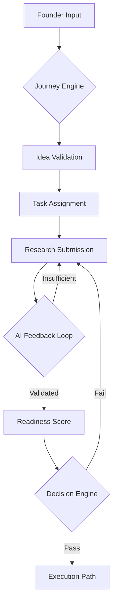

# VKai AI Brain: Startup Operating System Documentation

Welcome to the internal documentation of the **VKai AI Brain**. This system transforms VKai from a simple chatbot into a structured **Startup Operating System** that guides founders through the grueling journey of building a company.

---

## 🧠 Core Architecture

The AI Brain is a multi-layered engine designed to maintain state, evaluate progress, and assign execution tasks. It consists of five primary modules:

### 1. Journey Engine (`lib/startupJourneyEngine.ts`)
The **Orchestrator**. It manages the state machine of the founder's journey.
- **Stages**: `IDEA_INPUT` → `IDEA_VALIDATION` → `RESEARCH_PATH_SELECTION` → `RESEARCH_SUBMISSION` → `AI_FEEDBACK_LOOP` → `READINESS_SCORE`.
- **Function**: It intercepts user messages, pulls current context, and directs the flow to the appropriate handler.

### 2. Decision Engine (`lib/decisionEngine.ts`)
The **Logic Layer**. It acts as the "Gatekeeper" between stages.
- **Evaluation**: It analyzes `readinessScore`, `viabilityScore`, and `researchDepth`.
- **Thresholds**: Founders cannot proceed to execution unless they meet strict criteria (e.g., Readiness > 60).
- **Mentor Unlock**: Logic for unlocking the high-level "Mentor Mode" based on performance or subscription.

### 3. Task Engine (`lib/taskEngine.ts`)
The **Execution Layer**. It transforms AI advice into actionable work.
- **Dynamic Assignment**: Assigns specific tasks (e.g., "List 5 competitors") whenever a stage transitions.
- **Persistence**: Tracks task completion in the database, ensuring founders actually *do* the work before moving on.

### 4. Context Memory (`lib/contextMemory.ts`)
The **Persistent Memory**. It prevents the "Goldfish Effect" (the AI forgetting who you are).
- **Extraction**: Scrapes the entire history of validation data, research findings, and feedback logs.
- **Snapshotting**: Creates a `ContextMemory` object that is injected into every AI prompt, giving the mentor a "total recall" of your strengths, weaknesses, and past mistakes.

### 5. Mentor Mode (`lib/agents/mentorMode.ts`)
The **Executive Agent**. A high-level, critical-thinking persona.
- **Personality**: Unlike standard chatbots, the Mentor is blunt, strategic, and focused on unit economics and market fit.
- **Mistral Large/Mixtral Integration**: Uses advanced models to provide direct tactical advice rather than general platitudes.

### 6. AI Bridge (`lib/mistral.ts`)
The **Gateway**. Handles communication with NVIDIA NIM and Mistral AI.
- **Robustness**: Implements request timeouts, JSON safe-parsing, and multimodal support for images and documents.
- **Reliability**: Ensures all AI output is sanitized and formatted for the front-end dashboard.

### 7. Type Safety (`lib/types.ts`)
The **Contract Layer**. Defines the strict interfaces that bind the AI Brain parts together.
- **Integrity**: Enforces consistency across the Journey Stage, Task structures, and User subscription states.

---

## 🔄 The Feedback Loop

The AI Brain doesn't just say "Good job." It forces a validation loop:

---

## 🛠️ Technical Specifications

- **Models**: Primarily `mistralai/mistral-large-latest` for complex reasoning and `mixtral-8x22b-instruct` for structured JSON output.
- **Database**: Prisma + PostgreSQL (Neon).
- **Logic**: Strict JSON schema requirements for all AI responses to ensure the dashboard remains reactive.
- **Context Window**: 32k+ tokens with optimized memory prioritization.

---

## 🚀 How to Interface

When adding new features to the AI Brain, follow these rules:
1. **Never use `any`**: The brain depends on strict typing to prevent logic drift.
2. **Always update Memory**: If you add a new data field, ensure `extractMemoryFromJourney` captures it.
3. **Structured Responses ONLY**: Every agent must return a JSON object with a `humanReadable` field and accompanying system `data`.

---

*“An operating system for founders, not a toy for dreamers.”*

